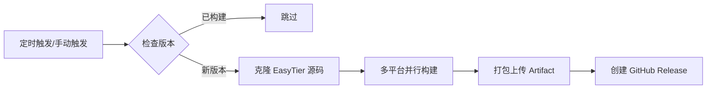

# easytier-ffi

[EasyTier](https://github.com/easytier/easytier) FFI 自动构建仓库。

每天自动检查 EasyTier 上游是否有新版本发布，如果有则自动构建 Windows / Linux / macOS / Android 多平台 FFI 动态库，并上传为 GitHub Artifact。

## 支持平台

| 平台 | 架构 | 产物 |
|------|------|------|
| Windows | x86_64 / x86 | `easytier_ffi.dll` |
| Linux | x86_64 / x86 / aarch64 / armv7 / riscv64 | `libeasytier_ffi.so` |
| macOS | x86_64 / aarch64 | `libeasytier_ffi.dylib` |
| Android | arm64-v8a / armeabi-v7a / x86 / x86_64 | `libeasytier_ffi.so` |

## 使用方式

### 自动构建

GitHub Actions 每天 UTC 0:00 自动检查 [EasyTier Releases](https://github.com/easytier/easytier/releases)，发现新版本后自动触发构建。

### 手动触发

在 [Actions](https://github.com/easytier/easytier-ffi/actions) 页面选择 `Build EasyTier FFI Libraries`，点击 **Run workflow**，可选择指定分支或 Tag（如 `main`、`v2.6.4`）。

### 下载产物

构建完成后，可在 [Releases](https://github.com/easytier/easytier-ffi/releases) 页面下载对应版本的各平台 `.tar.gz` 包，Release 版本号与 EasyTier 上游一致。

## 工作原理

1. **版本检查**：通过 GitHub API 获取 EasyTier 最新 Release tag，与本仓库已有 tag 比对
2. **并行构建**：13 个平台在各自 runner 上并行编译 Rust FFI cdylib
3. **产物归档**：每个平台独立打包为 `.tar.gz`，上传为 GitHub Artifact
4. **发布 Release**：全部构建成功后创建 GitHub Release，tag 与 EasyTier 上游一致，包含所有平台产物